## Automatic Detection of Offensive Jokes
CS7641 Course Project

### Introduction/Background

Natural language processing is a burgeoning field in machine learning that aims to give computers the ability of being able to comprehend human speech and text [6]. With the increased adoption of speakers and other tools that have in-built microphones and their use as digital assistants, it is imperative that these tools are able to decipher our specific speech patterns [7]. Similarly, NLP can be used in the moderation of chat based forums to ensure that those forum members are being courteous. 

Although it seems that offensive humor is not something that has been researched in detail, there are many papers detailing methods for detecting humor and others about detecting offensive language. In 2019 Weller et al., attempted to detect humor in jokes using a transformer model along with 16000 jokes scraped from reddit to try and use sentence context to detect humor in jokes [8]. This is not a trivial problem, as found by Karasakalidis et al in 2021, who attempted to determine the efficacy of modern machine learning technology regarding humor detection [9]. With respect to offensive language, algorithms based on linear SVM and naive bayes were used by De Souza et al. with above 90% accuracy [10]. 

Our dataset will come from Laugh Factory’s database where we will scrape labeled jokes of varying length from “Clean Jokes”, and “Insult Jokes”[4]. Currently, we are undecided regarding the dataset size. If required, we will scrape Reddit’s “r/jokes”[5] thread and use the tag “NSFW” to label offensive vs clean jokes.

### Proposal Video
<iframe width="560" height="315" src="https://www.youtube.com/embed/ky8RTUok4EY" title="YouTube video player" frameborder="0" allow="accelerometer; autoplay; clipboard-write; encrypted-media; gyroscope; picture-in-picture" allowfullscreen></iframe>

### Final Project Video
<iframe width="560" height="315" src="https://www.youtube.com/embed/k1bODK0mZrc" title="YouTube video player" frameborder="0" allow="accelerometer; autoplay; clipboard-write; encrypted-media; gyroscope; picture-in-picture" allowfullscreen></iframe>

### Problem definition
The internet provides ample opportunities to people to show the best and the worst in them. More often than not, people encounter one or the other kind of online digressions [11] that are intended to be spiteful. A shining occasion of this phenomenon is humor [12], under the veil of which specific communities of people are targeted and marginalized [13, 14]. Since the “line” between the innocuous and the malevolent humor is inherently blurred [15], it’s challenging to distinguish between the two. 

In this work, we aim to come closer towards finding this “line” with some of the recent data-driven approaches and also analyze their pros and cons. The broad goal of the work is the automatic detection and flagging of offensive humor in textual media, which can naturally have far-reaching consequences.

### Data Collection
As per our introduction, we collected data from "http://www.laughfactory.com/jokes" and visually examined the different categories of jokes we could pick from which are "Blonde Jokes", "Clean Jokes", "Family Jokes", "How to be Insulting", "Holiday Jokes", "Insult Jokes", "Sexist Jokes" and "Yo Momma Jokes". Using Beautiful Soup, we were able to scrape the joke data from each of these categories from Laugh Factory and use the category labels to label our data as well. With this mechanism, we scraped a total of 1886 labelled jokes that we then needed to clean. Again, through simple inspection of this website and it's jokes, we noticed that some of the jokes it included were quite long and contained sometimes 100's of words. We did not think that these jokes were of interest to us since we wanted to specifically classify shorter jokes as opposed to longer, satirical pieces so we decided to filter out "jokes" that were over 60 words long. We pretty much decided on 60 arbitratily since we felt as though more than 60 words could be considered a far longer joke which is out of scope/focus for us. This reduced our data set down to 1694 jokes. The next step was simply removing duplicate jokes from our dataset which then dropped our dataset down to 1611 jokes. Additionally to make our data easier to work with, we convert each of the joke class labels to an integer value using a simple mapping scheme as follows.
- 0 maps to "Yo-momma" jokes
- 1 maps to "Family" jokes
- 2 maps to "Insult" jokes
- 3 maps to "Clean" jokes
- 4 maps to "Blonde" jokes
- 5 maps to "Holiday" jokes
- 6 maps to "Sexist" jokes
- 7 maps to "How to Be Insulting" jokes

The below histogram exemplifies our distribution of data as per our mapping/labelling scheme and we can see that our data is not necessarily equally distributed amongst our classes which could affect the results of our models. For example, nearly half of our data comes from "Yo-momma" jokes so we can definitely learn to classify those jokes better than we could say "Family" jokes which has far less.

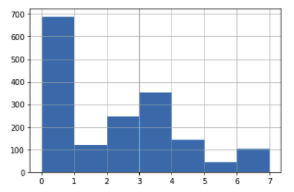

We randomly split the 1611 in 80:20 ratio to generate our training and testing splits.

### Data Set Histograms and Distributions

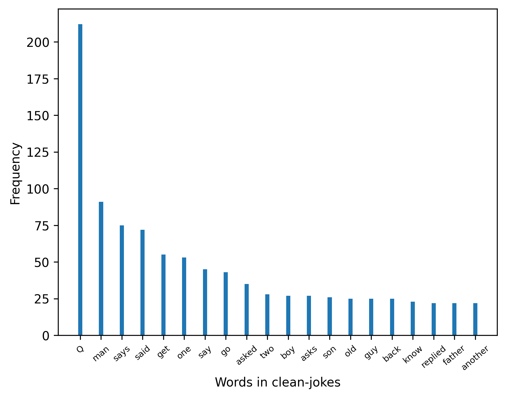

As can be seen in the clean jokes histogram, most of the jokes that have been marked as clean usually are posed as a question answer based joke. Additionally, these jokes are often a kind of back-and-forth style of joke or even a conversation based joke. 

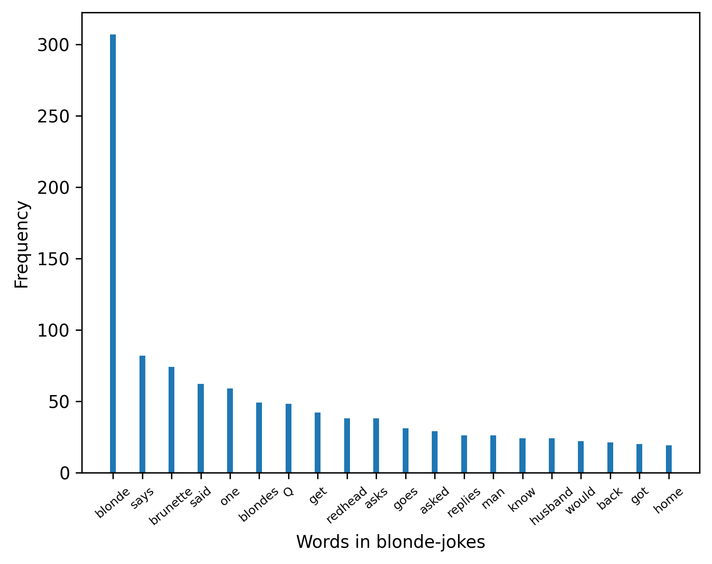

As expected, these jokes often explicitly mention blond or blondes and usually specify other characters in the joke's context by describing their hair color. Thus, we see brunette or redhead as other common words in these jokes.

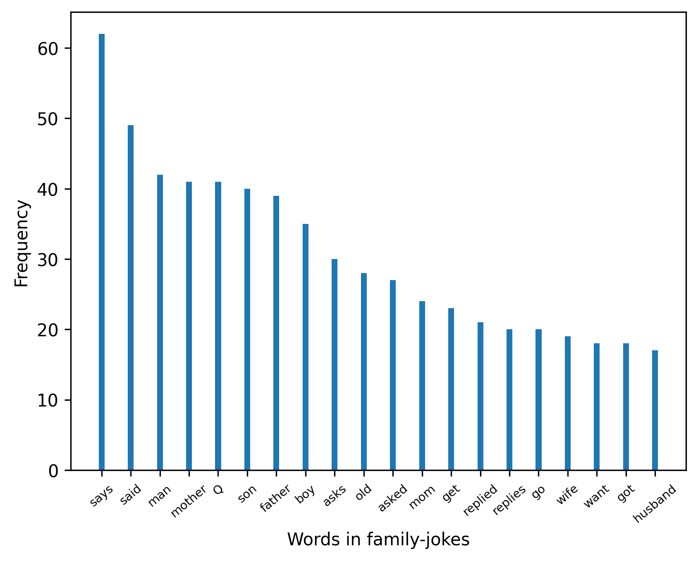

These jokes usually have a lot of family role specific words used in them. Words like mom, father, son, daughter show up frequently and jokes containing these words are immediately tagged as family. 

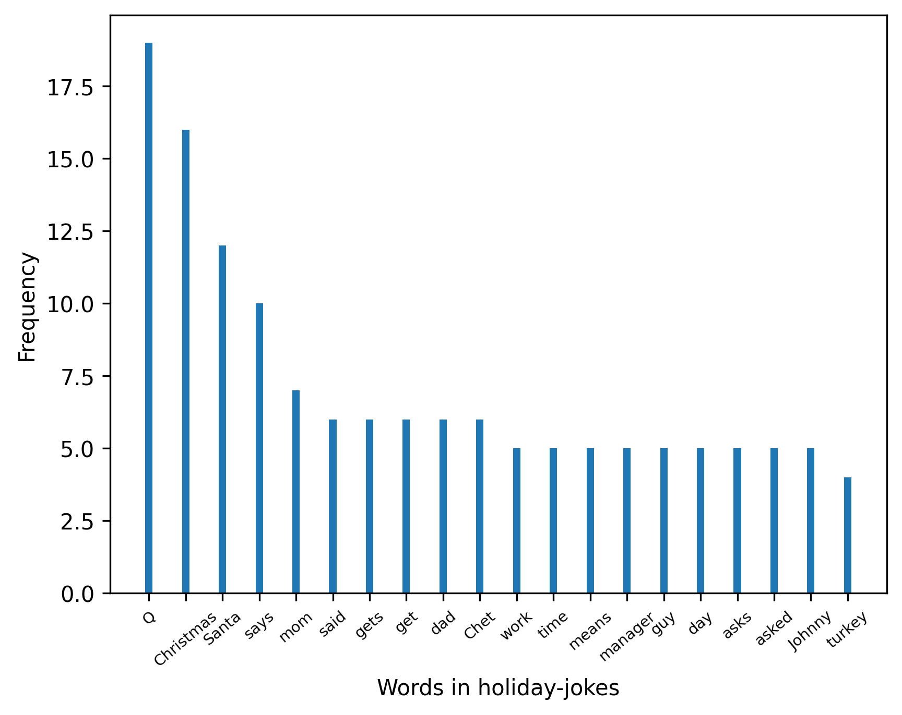

Holiday jokes often contain words that are most commonly associated with christmas. Thus, words like christmas and santa are found often in such jokes.

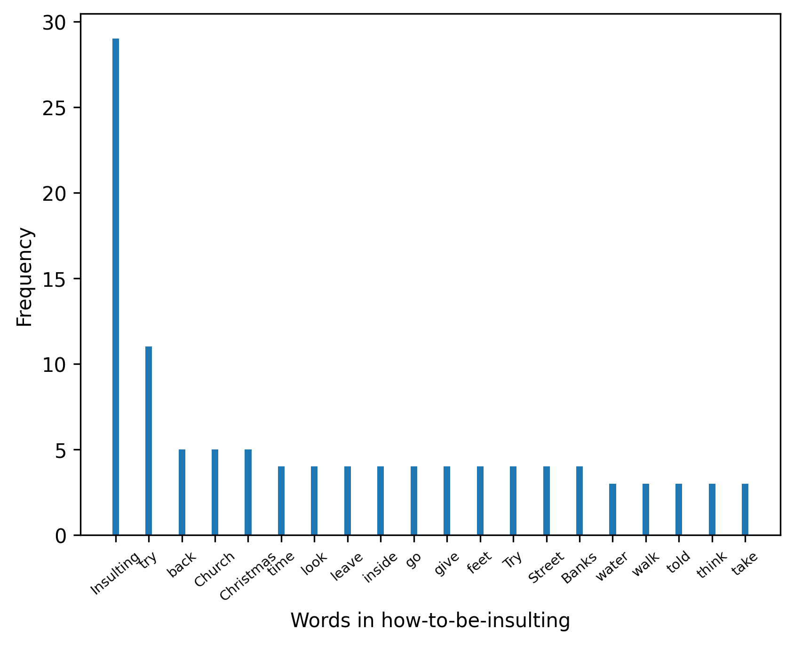

There are not many well correlated words within this category of jokes other than the fact that insulting is a popular tagged word.

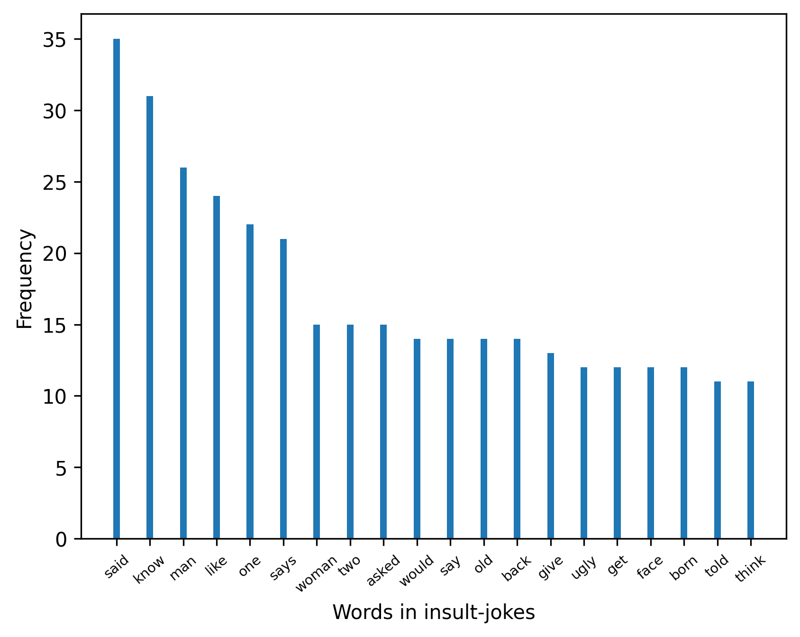

The most common words in these jokes are words that describe the characters used within the context of the joke. Other words that are more characteristic of insults show up lower on the histogram. 

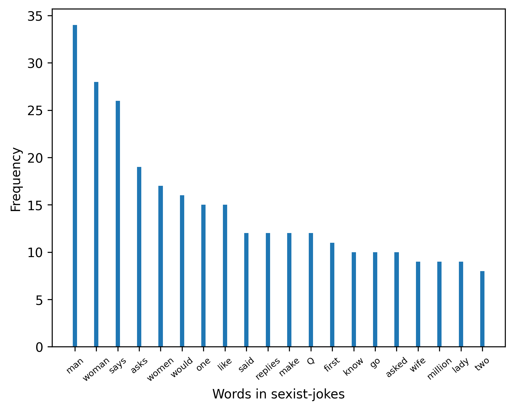

The sexist jokes histogram contains mostly words like man, woman and women, probably because these jokes are discussing stereotypes or gender roles.

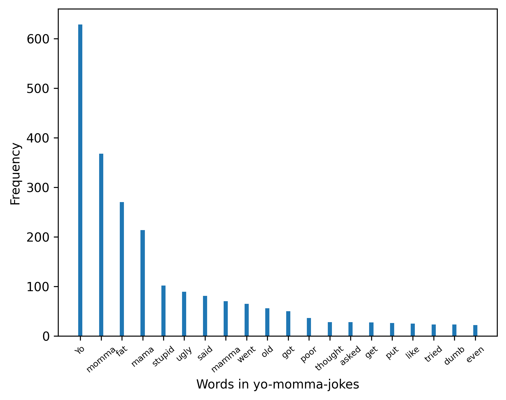

As expected, yo and different spellings of mama (momma, mamma, ma, mom) are most characteristic of yo-momma jokes. 

This concludes our section on raw data collection and moderate cleaning. We genearate the features for our dataset next. 

### Feature Generation and Reduction Strategy

Since we scrape only the text joke data from Laugh Factory we technically start with no features and thus must generate them ourselves. With this in mind, we originally planned on using a Bag-of-Words model to create features that captured the number of word occurrences per joke but we decided to switch to using a Term Frequency - Inverse Document Frequency (TF-IDF) model instead after a little bit of researching our options and looking at previous literature. We decided to make this switch because TF-IDF would allow us to model/capture "how important a word is to a document in a collection or corpus". [16]. Additionally, we found a previous research project from 2017 that attempted to automate hate speech detection and classification. We found from this research paper that they constructed features by creating n_grams from values 1-3 and then computing TF-IDF values for each n_gram. Additionally, they also generated features related to parts of speech tagging, sentiment features created using sentiment libraries, syllable metrics, and two quantities known as FKRA and FRE which are related to readability [17]. Davidson et. al were able to succesfully classify hate speech and so given the similarity between our problem spaces, we decided to adopt the same feature generation process they used which are namely, the TF-IDF values for all possible 1-3 n_grams, parts of speech, and other features like sentiment, syllables, and readibility. After running the feature generation we get 1284 features from our data. 

#### Feature Reduction
After fitting the data using the best performing method, we use feature importances to perform feature reduction. By performing importance-based feature selection, we are able to reduce the 1284 features to 143 features without compromising on the achieved accuracy. We discuss the feature reduction procedure and the obtained results in the Results section.

### Methods

#### Proposal
We’ll try both the supervised and unsupervised approaches. For supervised learning, we’ll start with a basic Bag of Words [1] (BoW) based model and then try modern deep learning-based architectures like BERT [2]. For unsupervised, we’ll try LDA [3] and hierarchical clustering. Then we’ll explore making architectures specific to this problem.

#### Midterm Report
We experimented with different types of supervised methods including K-Nearest Neighbors, Logistic Regression, Kernel SVM, Decision Tree, Random Forest, Gradient Boosting and AdaBoost which are described briefly. These were chosen as our possible models through brief literature surveys as well as potential supervised models of interest, and we decided to use them all to find our most optimal. 

- K-Nearest Neighbors which is a non-parametric method that utilizes a given datapoint's K-nearest neighbors to determine the classification of the point. The majority class that appears amongst the neighbors will also serve as the points classification. 
- Logistic Regression learns a multinomial linear classifier and serves as a useful baseline.
- Kernel SVM implicitly transforms the data points non-linearly into a high dimensional space and learns a linear large margin classifier in this feature space. 
- Decision Trees are non-parametric methods that learn piecewise constant decision boundaries based on simple decision rules. 
- Random Forests are a collection of decision trees that aim to reduce overfitting to the training set. 
- Gradient boosting and AdaBoost are boosting methods that produce an ensemble of decision trees and usually outperform random forests. 

#### Final Report
Although our task is well-suited for supervised classification, we also experimented with unsupervised methods to compare with the supversied methods. We used Sentence-BERT [19] to extract the feature representations of the jokes and experimented with different types of clustering algorithms including k-means, agglomerative clustering, and a modified form of clustering which we refer to as insightful clustering (explained later). We find the mode of the labels of the points belonging to the clusters and assign those labels to the clusters. For a test data point, we find the nearest cluster and predict the label as the label of the cluster. 

Furthermore, we also experiment with a supervised kNN and logistic regression classifier where the feature representations are extracted from Sentence-BERT to observe whether the improvments made by the modern deep learning architectures over classic hand-engineered features translate to our use-case as well. We present detailed results, analysis, and discussion from these experiments below.

### Results and Discussion
#### Proposal
Through exploring different clustering algorithms, we hope to eventually find a clear split between offensive and clean jokes and potentially unearth new sub-groupings between jokes as well. From our supervised learning portion, we hope to at least achieve 70% accuracy - basing off of previous literature - in classifying offensive jokes. 

#### Midterm Report
#### Classifier Learning Curves
Below are the learning curves for the various different classifiers that we tried to run on the available data. These plots show both the training (blue line) and the validation set (orange line) scores versus the training set size. 

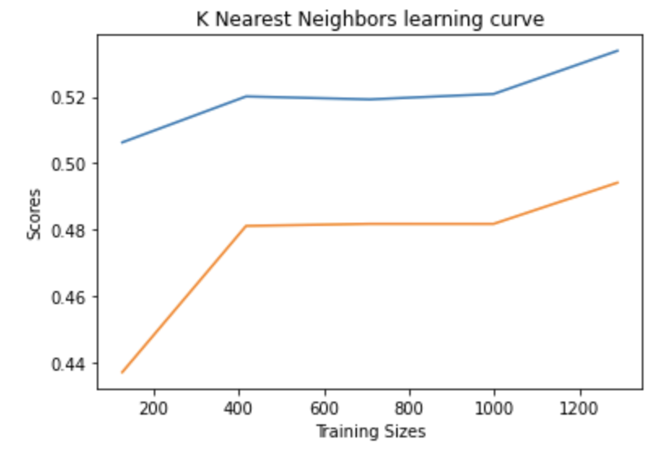 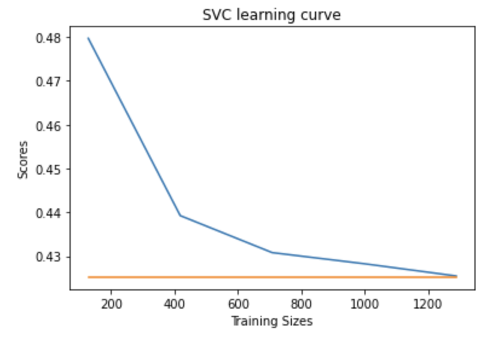
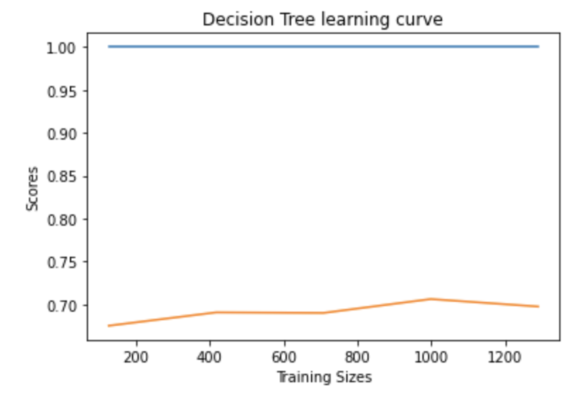
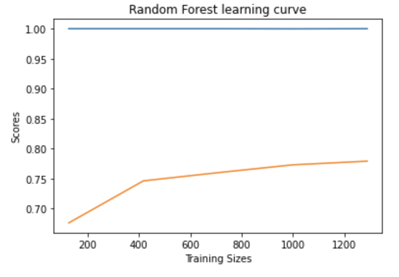
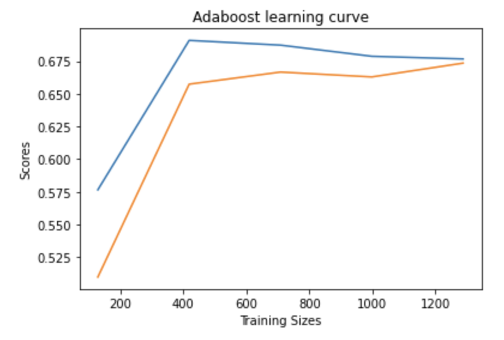
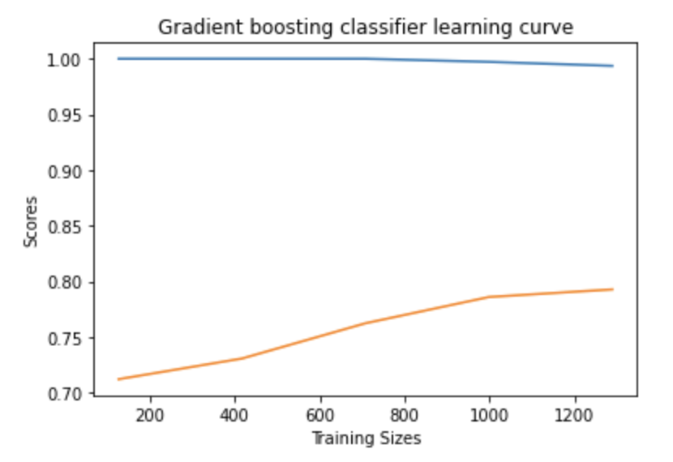
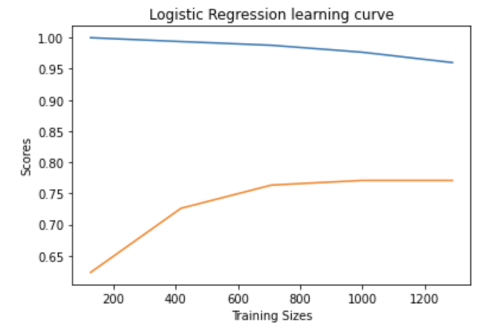

As can be seen from the validation score trend lines, the logistic regression, gradient boosting algorithm and random forest classifiers performed the best. With these classifiers we are able to achieve a cross-validation accuracy of close to 80% which meets our self-imposed performance threshold that we wished to require. The next step is to run a grid search on these classifiers to determine ideal hyper parameters to see whether the accuracy can be increased further. 

#### Model selection
We perform 5-fold cross-validation (CV) on the training split to choose the best performing method. We report the mean cross validation accuracy obtained by fitting our data using the different supervised methods.

| **Method**                          | **5-fold CV accuracy** |
|-------------------------------------|:----------------------:|
| K-nearest neighbor classifier (K=9) |          49.22         |
| SVC                                 |          42.70         |
| Decision tree classifier            |          69.79         |
| Random forest classifier            |          78.18         |
| AdaBoost classifier                 |          62.58         |
| Gradient boosting classifier        |        **78.26**       |
| Logistic Regression                 |          78.18         |

We choose Gradient boosting classifier as the best performing model and perform further analysis.

#### Accuracy
Using Gradient boosting classifier, we achieve an overall test accuracy of 76.78.

#### Feature reduction
We perform feature reduction using feature importances obtained after fitting the Gradient boosting classifier. 

The feature importance scores for a gradient boosting classifier are obtained by averaging the feature importance scores of the individual decision trees comprising the ensemble. For a decision tree in the ensemble, the importance for a feature is determined using the Gini importance, also known as MDI (mean decrease in impurity). MDI for a feature is computed by counting the points in the decision tree where the feature is used weighted by the proportion of samples it splits [18]. 

Only the features having feature importance score below a threshold (the mean feature importance) are selected. With this, we reduce the 1284 feature set to a subset of 143 features. After performing feature reduction, we again fit the Gradient boosting classifier and obtain a test accuracy of 75.85, which is a slight drop in accuracy but given the fact that we are able to reduce the dimensionality significantly, we believe that this slight loss is acceptable. 

#### Confusion Matrix
We now display the confusion matrix obtained on the test set using the model fit on the reduced set of features. The cell (i, j) gives the number of test samples belonging to i-category that are predicted by the model as j-category samples.

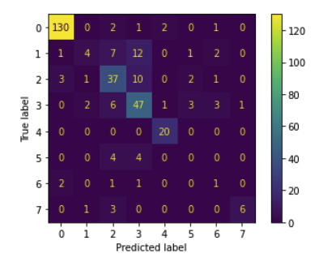

#### Class-wise scores
We now report the class-wise F1 scores achieved by our best performing model. We find that our model performs significanlty well on predicting "yo-mama" and "blonde" jokes, moderately well on "insult", "clean" and "how to be insulting" jokes, and very poorly on "family", "holiday" and "sexist" jokes. 

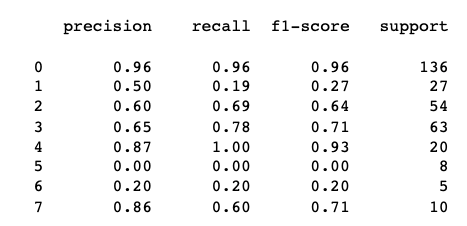 

Please reference the category names provided in Data Collection section for the label-category mapping.

#### Final Report
#### Model selection
We perform 5-fold cross-validation (CV) on the training split to compare the different methods and report the mean cross-validation accuracy.

| **Method**                                                                    | **5-fold CV accuracy**        |
|-------------------------------------------------------------------------------|:-----------------------------:|
| Sentence-BERT w/h k-means (k=8)                                               |          80.13                |
| Sentence-BERT w/h agglomerative clustering (k=8)                              |          76.24                |
| Sentence-BERT w/h insightful clustering (k1=2, k2=7)    |          80.44                |
| Sentence-BERT w/h k-NN                                                        |          81.83                |
| Sentence-BERT w/h logistic regression                                         |          <b>85.17</b>         |

It can be observed that we achieve a competitive performance even when using clustering-based methods on top of the feature representations extracted from Sentence-BERT. An important thing to note is that we developed the insightful clustering method based on the the t-SNE visualizations and it outperforms the other unsupervised methods. Our hypothesis is that there are separate clusters present in the original t-SNE visualization and possibly a 2-stage k-means can provide better clustering for this kind of data. Hence we run k-means twice, first with k = 2 and then with k = 7 for the data points belonging to that cluster which seems to have a high variance.

This shows that while deep learning based methods can be good feature extractors, the insights from the data visualizations can be leveraged to improve performance even further. Finally logistic regression classifier achieves the best performance so far when trained on top of a frozen Sentence-BERT which shows the extent of possible improvements when using deep-learning based methods instead of hand-engineered features.

#### Accuracy
Using the best model on the basis of the cross-validation experiments: Sentence-BERT with logistic regression, we obtain an accuracy of <b>81.42</b> on the test set. Note that significantly higher than the test accuracy (76.78) obtained when using TF-IDF and hand engineered features that we were using earlier.

We also report the test accuracies obtained by different clustering-based methods: 

| **Method**                                                                    | **Test accuracy**      | 
|-------------------------------------------------------------------------------|:----------------------:|
| Sentence-BERT w/h k-means (k=8)                                               |          78.02         |
| Sentence-BERT w/h agglomerative clustering (k=8)                              |          76.16         |
| Sentence-BERT w/h insightful clustering (k1=2, k2=7)    |          78.95         |

#### Feature visualization
We visualize the t-SNE embeddings extracted from Sentence-BERT for understanding the distribution of the feature representations. The feature representations seem to be class discriminative even when they are not explicitly trained for the task.

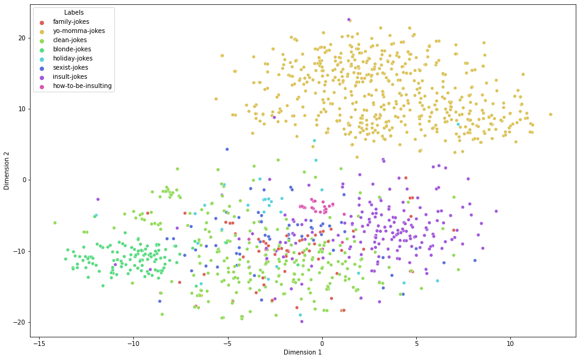

Furthermore, the visualizations with k-means and agglomerative clustering appear to be sub-optimal which motivated us to start with a less number of clusters and then increase the clusters in order to match the previous visualization. Indeed the clustering appears to be better with insightful clustering which also translates to a better validation performance.

##### K-means 
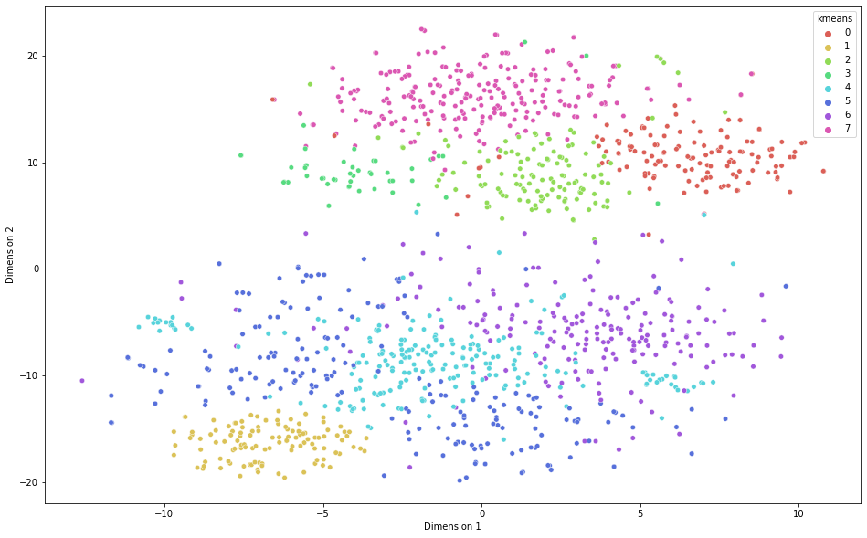
 

##### Agglomerative 
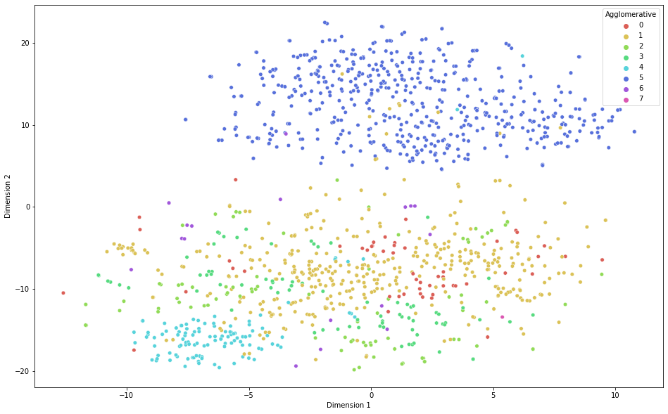
 

##### Insightful clustering  
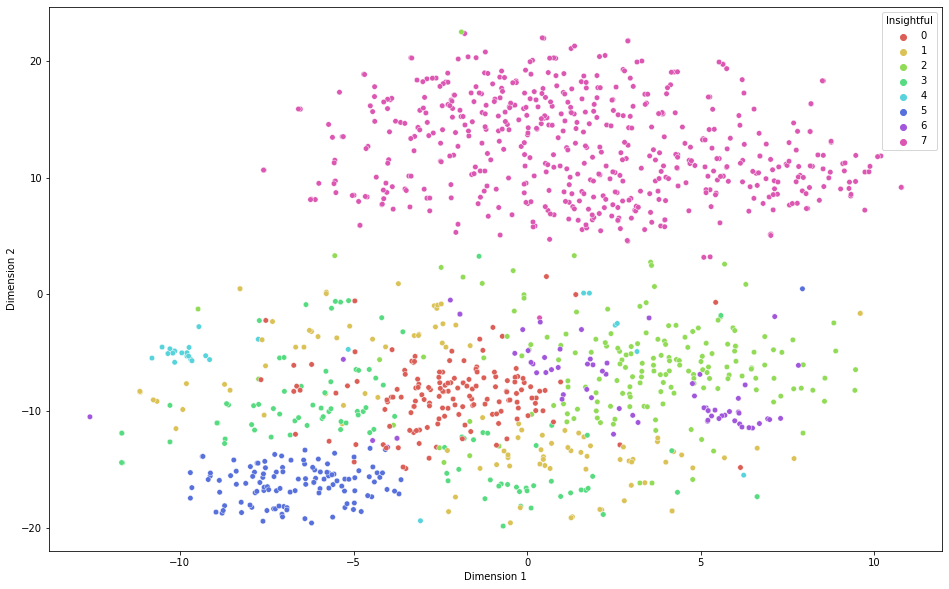
 

#### Confusion Matrix
We show the confusion matrices for the overall best performing method viz Sentence-BERT with Logistic Regression below.  

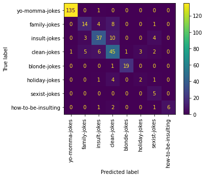

#### Class-wise scores
We report the per-class F1 scores achieved by the overall best performing method (Sentence-BERT w/h Logistic Regression) below. We observe that the method is significantly accurate on "yo-mama" and "blonde" jokes, moderately accurate on "insult", "clean" and "how to be insulting" jokes, and quite inaccurate on "family", "holiday" and "sexist" jokes.  

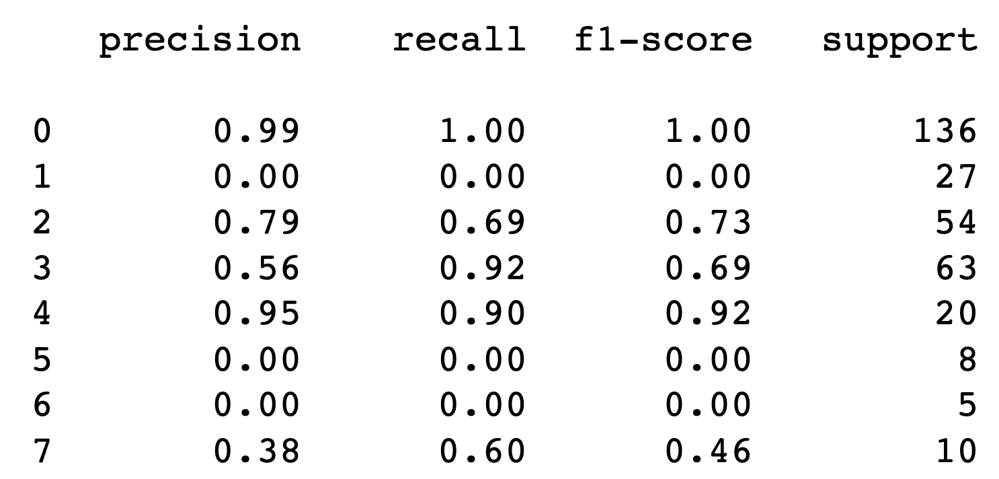 

### Conclusion
After having completed our project there are a few key takeaways and concluding points that we would like to focus on. The first point is that our dataset is not necessarily equally distributed amongst our classes of interest. From our data portion, it can be seen that we have an excessive amount of "yo-momma" jokes as compared to other classes and thus our models might potentially be overfitting to certain classes. This yields the need for future work in data collection to supplement the other under-represented classes. Another takeaway we learned was the importance and ease of utilizing deep-learning architecture for feature representation creation. We had originally done our feature generation using Davidson et. al's previous work and manually constructed our features but afterwards, we had seen the efficacy using Sentence-BERT and then recreated our feature set using that technique. Follow-up testing showed us that these deep-learning technqiues were more effective and probably more efficient in our classifer training and thus will be a lesson learned we carry forward. The last big takeaway was the importance of visualization. Had we not tried to perform feature reduction using PCA/t-SNE and then visualize it, we would not have been able to come up with our novel "insightful clustering" technique. Although visualization of our dataset in this space allowed us to create this algorithm, we need to also collect more data to validate whether this pattern generally holds. 

### Timeline and Responsibilities
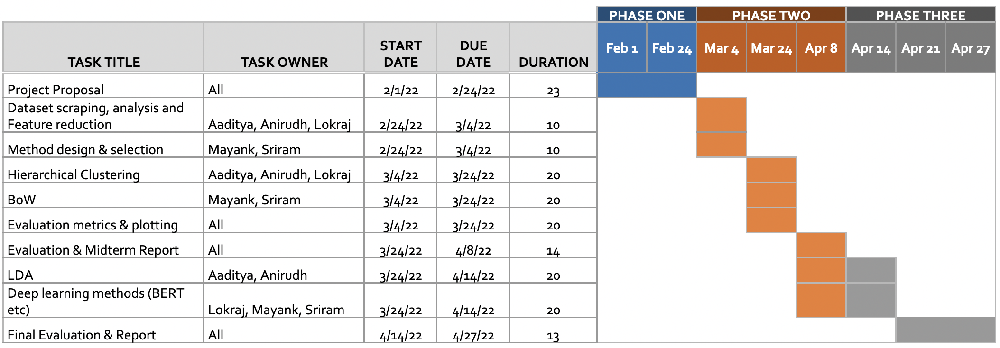

### References
1. Harris, Z.S. (1954). Distributional Structure. WORD, 10, 146-162.
2. [BERT: Pre-training of Deep Bidirectional Transformers for Language Understanding](https://aclanthology.org/N19-1423) (Devlin et al., NAACL 2019)
3. David M. Blei, Andrew Y. Ng, and Michael I. Jordan. 2003. Latent dirichlet allocation. J. Mach. Learn. Res. 3, null (3/1/2003), 993–1022. 
4. [Insult Jokes – Funny Insulting Jokes: Laugh Factory](http://www.laughfactory.com/jokes/insult-jokes). Insult Jokes – Funny Insulting Jokes \| Laugh Factory.
5. [“r/Jokes.”](https://www.reddit.com/r/Jokes/) Reddit. 
6. By: IBM Cloud Education. [“What Is Natural Language Processing?”](https://www.ibm.com/cloud/learn/natural-language-processing) IBM. 
7. Rose Asogwa. [“Robust NLP for Voice Assistants.”](https://blog.webex.com/engineering/robust-nlp-for-voice-assistants/) Welcome to the Video Conferencing Hub, 8 June 2021. 
8. Weller, Orion and Kevin D. Seppi. [“Humor Detection: A Transformer Gets the Last Laugh.”](https://aclanthology.org/D19-1372.pdf) EMNLP (2019). 
9. [DUTH at SemEval-2021 Task 7: Is Conventional Machine Learning for Humorous and Offensive Tasks enough in 2021?](https://aclanthology.org/2021.semeval-1.157) (Karasakalidis et al., SemEval 2021).
10. [Automatic Offensive Language Detection from Twitter Data Using Machine Learning and Feature Selection of Metadata.](https://ieeexplore.ieee.org/document/9207652) (De Souza et al., IJCNN 2020).
11. [Hate speech online](https://www.usatoday.com/story/news/2019/02/13/study-most-americans-have-been-targeted-hateful-speech-online/2846987002/) - USA Today.
12. [Humour - Wikipedia](https://en.wikipedia.org/wiki/Humour).
13. [Racist Acts and Racist Humour](https://www.cambridge.org/core/journals/canadian-journal-of-philosophy/article/abs/racist-acts-and-racist-humor/4668492D5D86FB1F076A221307DCCBCC) - Cambridge University Press.
14. [Is it really just a joke? Gender differences in perceptions of sexist humor](https://doi.org/10.1515/humor-2019-0033) (Lawless et al., HUMOR, 33(2), 291-315).
15. [When the lines between offensive comedy and off-limits jokes are blurred](https://www.abc.net.au/everyday/knowing-when-comedy-crosses-a-line/11090890) - ABC Everyday.
16. [BoW vs. TF-IDF Blog](https://www.analyticsvidhya.com/blog/2020/02/quick-introduction-bag-of-words-bow-tf-idf/#:~:text=Bag%20of%20Words%20just%20creates,less%20important%20ones%20as%20well)
17. [Automated Hate Speech Detection and the Problem of Offensive Language](https://arxiv.org/abs/1703.04009) (Davidson et. al., ICWSM 2017).
18. [Understanding Random Forests: From Theory to Practice](https://arxiv.org/pdf/1407.7502.pdf)
19. [Sentence-BERT: Sentence Embeddings using Siamese BERT-Networks](https://arxiv.org/abs/1908.10084)
